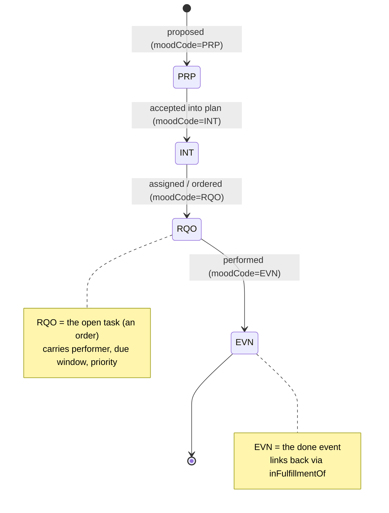
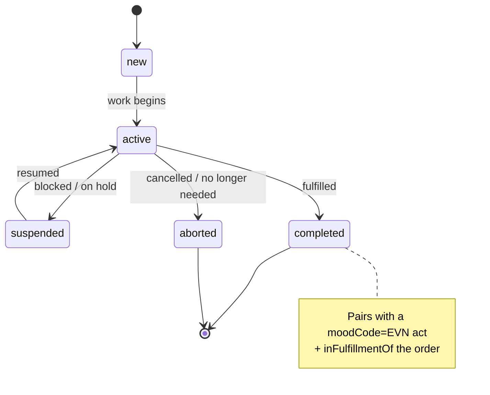
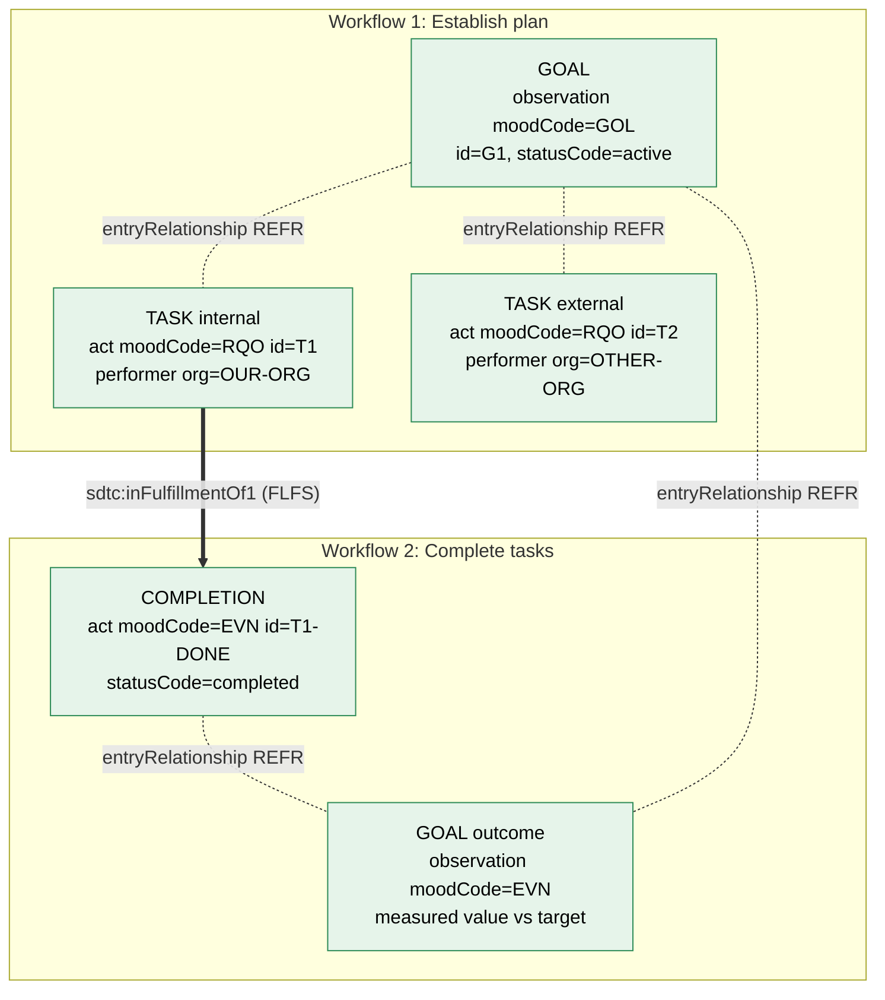
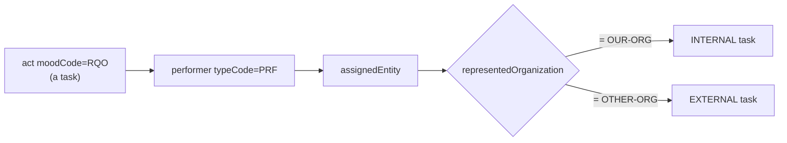

# Care-Plan Task State Machine (the stable spine)

These diagrams render on GitHub. They describe the **data state machine** that your
business process maps onto. The clicks/screens/order can change freely; these
transitions are the contract that does not break.

> Verified against the schema in this repo
> (`schema/extensions/SDTC/...`): the `moodCode` and `statusCode`
> vocabularies and the `inFulfillmentOf` / `entryRelationship` linkages are real
> CDA R2.0 constructs, not invented.

---

## 1. The `moodCode` lifecycle of a single task

The same act (same `code`, same `id`) is walked from "requested" to "happened".
That walk **is** task completion — independent of any UI.

---

## 2. The `statusCode` lifecycle within a task

`moodCode` says *what kind of reality*; `statusCode` says *where in its life*.
A task in `RQO` mood moves through these states as work proceeds.

---

## 3. End-to-end: both workflows over the same atoms

**Reading the green nodes:** every box is a CDA data atom with a stable `id`.
The arrows are the *contract* (fulfillment + reference links). A UI redesign
rearranges *how* a human creates these nodes; it cannot change *what* the nodes
are or how they reconcile.

---

## 4. Internal vs. external — same atom, one differing field

There is no separate "external task" object. Internal vs. external is a single
data fact (`representedOrganization` + the `id` root namespace). This is why a
process built on the data model doesn't fork into brittle internal/external
branches.
