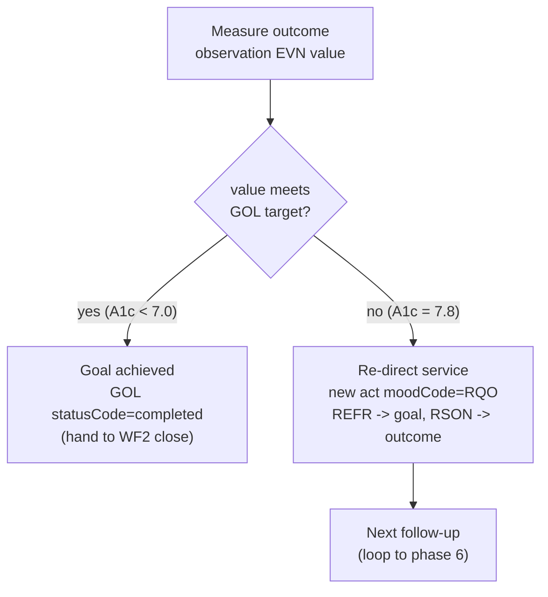

# WF3 — Follow-up & Evaluate (the loop-closing workflow)

Realizes cycle phases **6 Monitor → 7 Evaluate → 8 Revise** from
[`clinical-process.md`](clinical-process.md). This is the workflow where the
*intentional direction of services* is **tested**: did the services move the
goal? If not, the plan re-directs.

Reference instances:
[`careplan-followup-example.xml`](careplan-followup-example.xml) (schema-valid CDA),
[`careplan-followup-example.fhir.json`](careplan-followup-example.fhir.json) (FHIR mirror),
[`careplan-followup-example.rendered.html`](careplan-followup-example.rendered.html) (render).

## The clinical story encoded

1. Original plan set **Goal G1: A1c < 7.0%** and ordered education task **T1** (now completed).
2. At follow-up, A1c is **measured = 7.8%** → goal **not met**.
3. Because of that gap, a **new service T3** (pharmacologic management) is directed.
4. T3 is justified two ways in data: it **serves** the goal and exists **because of** the outcome.

## Process map (data-anchored)

| # | Step (business action) | Lane (who clicks) — *volatile* | Data object — *stable* | State in → State out | Key fields |
|---|---|---|---|---|---|
| 1 | Conduct follow-up visit | Provider/RN | `encounter moodCode=EVN` | — → `EVN / completed` | `effectiveTime`, `code` |
| 2 | Record outcome measure | RN / lab feed | `observation moodCode=EVN` | — → `EVN / completed` | `value` (7.8%), `interpretationCode=H` |
| 3 | Tie outcome to its goal | System | `entryRelationship typeCode=REFR` (outcome → `GOL`) | (link) | outcome A1C-1 → goal G1 |
| 4 | Evaluate goal achievement | Provider | `observation moodCode=GOL` `statusCode` / FHIR `Goal.achievementStatus` | `GOL / active` stays `active` | not-achieved (7.8 > 7.0) |
| 5 | Decide: revise vs. close | Provider | (gateway) | branch | met → close (WF2); not met → revise |
| 6 | Direct a new service | Provider | **new** `act moodCode=RQO` | — → `RQO / active` | `id=T3`, `code`, due window |
| 7 | Justify it — serves goal | System | `entryRelationship typeCode=REFR` (T3 → `GOL`) | (link) | T3 → G1 |
| 8 | Justify it — reason | System | `entryRelationship typeCode=RSON` (T3 → outcome) | (link) | T3 → A1C-1 |

## The decision gateway (step 5)

**Why this is robust:** the branch condition is a **data comparison**
(`outcome.value` vs. `GOL target`), not a UI rule. Whatever screen a clinician
uses, "is the measured value within the goal target?" is answerable from the data
alone — so the re-direct-vs-close decision survives any interface change. And the
loop's continuation is enforced by data dependency: the next service (T3) is
literally built from the outcome (A1C-1) and the goal (G1) of this round.

## CDA vs. FHIR for the evaluation (one honest difference)

| Concept | CDA | FHIR |
|---|---|---|
| Outcome measured | `observation moodCode=EVN` + `value` | `Observation` `status=final` + `valueQuantity` |
| Outcome measures the goal | `entryRelationship typeCode=REFR` | `Goal.outcomeReference → Observation` |
| Goal not yet achieved | `GOL` `statusCode=active` | `Goal.achievementStatus = not-achieved` |
| New service serves the goal | `entryRelationship typeCode=REFR` (act → GOL) | weaker — rides through `CarePlan.goal` + `CarePlan.activity` |
| New service's reason | `entryRelationship typeCode=RSON` (act → outcome) | `Task.reasonReference → Observation` |

FHIR's `Goal.achievementStatus` is actually *more expressive* than CDA here
(it has a dedicated value set: improving, worsening, not-achieved, achieved…).
CDA's act→goal `REFR` "serves" link is *stronger* than R4 Task's goal linkage.
Both gaps are noted so the adapter layer can normalize them later.
