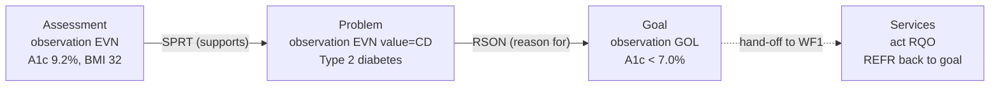

# WF4 — Assess & Identify Problems (the start of the arc)

Realizes cycle phases **1 Assess → 2 Identify problem** from
[`clinical-process.md`](clinical-process.md), and hands off to **WF1** by
producing the problem that a goal addresses. This is the *justification root*:
every downstream goal and service can be traced back to a problem that is itself
grounded in measured data.

Reference instances:
[`careplan-assessment-example.xml`](careplan-assessment-example.xml) (schema-valid CDA),
[`careplan-assessment-example.fhir.json`](careplan-assessment-example.fhir.json) (FHIR mirror),
[`careplan-assessment-example.rendered.html`](careplan-assessment-example.rendered.html) (render).

## The clinical story encoded

1. **Assess** — baseline data measured: A1c = 9.2% (High), BMI = 32.
2. **Identify** — a problem is named: **Type 2 diabetes mellitus**, *supported by* the A1c.
3. **Hand-off** — a **goal** (A1c < 7.0%) is set that **addresses** the problem.
4. (WF1 then attaches services that serve the goal.)

## Process map (data-anchored)

| # | Step (business action) | Lane (who clicks) — *volatile* | Data object — *stable* | State in → State out | Key fields |
|---|---|---|---|---|---|
| 1 | Capture assessment data | RN / device / lab feed | `observation moodCode=EVN` | — → `EVN / completed` | `value` (A1c 9.2%, BMI 32), `interpretationCode` |
| 2 | Open a problem concern | Provider | `act moodCode=EVN` (concern) | — → `active` | concern `id`, `statusCode=active` |
| 3 | Name the problem | Provider | `observation moodCode=EVN`, `value xsi:type=CD` | — → `completed` | diagnosis code (SNOMED 44054006) |
| 4 | Ground problem in evidence | System | `entryRelationship typeCode=SPRT` (problem → assessment) | (link) | PROB-1 → A1C-0 |
| 5 | Set goal addressing problem | Provider | `observation moodCode=GOL` | — → `GOL / active` | target `value`, due window |
| 6 | Link goal to its problem | System | `entryRelationship typeCode=RSON` (goal → problem) | (link) | G1 → PROB-1 |

## The justification chain (front of the arc)

**Why this matters for robustness:** the chain `assessment → problem → goal →
service` is a chain of **data links** (`SPRT`, `RSON`, `REFR`), not a sequence of
screens. Auditing "is this goal grounded in a real, evidenced problem?" and "is
this problem grounded in measured data?" becomes a graph traversal — answerable
no matter how the UI presents it. A goal with no `RSON` link to a problem, or a
problem with no `SPRT` link to data, is visibly unjustified.

## CDA ↔ FHIR for assessment/problem

| Concept | CDA | FHIR |
|---|---|---|
| Assessment datum | `observation moodCode=EVN` + `value` | `Observation` `status=final` |
| Problem (the concern) | `act moodCode=EVN` (problem concern act) | `Condition` (`category=problem-list-item`) |
| Problem (the diagnosis) | `observation` `value xsi:type=CD` | `Condition.code` |
| Problem supported by data | `entryRelationship typeCode=SPRT` | `Condition.evidence.detail` |
| Goal addresses problem | `entryRelationship typeCode=RSON` (goal → problem) | `Goal.addresses → Condition` |

This step maps **cleanly** in both directions — `Goal.addresses` and
`Condition.evidence` are first-class FHIR elements, so unlike the WF3 evaluation
step, there is no expressiveness gap to normalize here.
