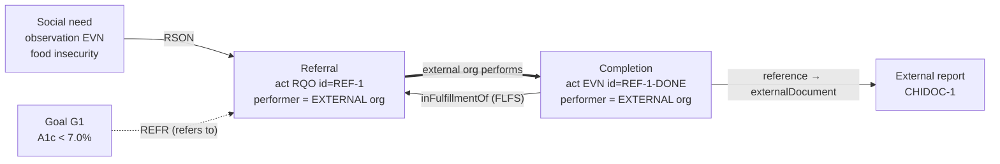

# WF5 — Referral / External Hand-off (closed-loop)

Realizes cycle phase **4 Direct services** in its **external** variant: a service
directed to an outside team member/organization, with the loop closed when that
org reports back. Structurally this is **not new machinery** — it is an ordinary
service order whose performer happens to sit in a different organization, plus
the same `inFulfillmentOf` link used for any task completion.

Reference instances:
[`careplan-referral-example.xml`](careplan-referral-example.xml) (schema-valid CDA),
[`careplan-referral-example.fhir.json`](careplan-referral-example.fhir.json) (FHIR mirror),
[`careplan-referral-example.rendered.html`](careplan-referral-example.rendered.html) (render).

## The clinical story encoded

1. A **health-related social need** is identified — food insecurity (a barrier to glycemic control).
2. A **referral** (`act moodCode="RQO"`) is directed to an external **Community Health Integration** org.
3. The referral is justified in data: `REFR`→ the A1c goal (it serves the goal by removing a barrier), `RSON`→ the social-need observation (the why).
4. **Loop closure:** the external org reports completion (`act moodCode="EVN"`, `inFulfillmentOf` the referral) with a `reference` to its external report.

## Process map (data-anchored)

| # | Step (business action) | Lane (who clicks) — *volatile* | Data object — *stable* | State in → State out | Key fields |
|---|---|---|---|---|---|
| 1 | Identify social need | RN / screening | `observation moodCode=EVN` `value=CD` | — → `completed` | food insecurity (SNOMED/ICD) |
| 2 | Create referral | Provider | `act moodCode=RQO` (referral) | — → `RQO / active` | `id=REF-1`, referral `code`, due window |
| 3 | Route to external org | System | `performer` → external `representedOrganization` | (assign) | org = COMMUNITY-ORG (outside) |
| 4 | Record referred-by / -to | System | `participant typeCode=REFB` / `REFT` | (link) | internal DR-1 / external NAV-1 |
| 5 | Justify — points at goal | System | `entryRelationship typeCode=REFR` ("refers to"; a convention, not a built-in "serves") | (link) | REF-1 → G1 |
| 6 | Justify — reason | System | `entryRelationship typeCode=RSON` | (link) | REF-1 → SDOH-1 |
| 7 | External org performs & reports | External team | **new** `act moodCode=EVN` | — → `EVN / completed` | performer = external org, `effectiveTime` |
| 8 | Attach external report | External team | `reference` → `externalDocument` | (link) | CHIDOC-1 |
| 9 | Close the loop | System | `sdtc:inFulfillmentOf1` (`FLFS`) | EVN → referral `RQO` | REF-1-DONE → REF-1 |

## Closed-loop referral

**Why the boundary is just a data fact:** the *only* thing that makes this
external rather than internal is the `representedOrganization` behind the
`performer` (and the `id` root namespace). Identity, justification links, and the
fulfillment loop are identical to an internal task. So an internal task and a
multi-party external referral are the **same object** with one field changed —
which is exactly the property that lets a workflow span organizational boundaries
without new process logic.

## CDA ↔ FHIR for referral

| Concept | CDA | FHIR |
|---|---|---|
| The referral (request) | `act moodCode=RQO` (referral) | `ServiceRequest` `intent=order` |
| Referred-by | `participant typeCode=REFB` | `ServiceRequest.requester` |
| Referred-to (external) | `participant typeCode=REFT` + external `representedOrganization` | `ServiceRequest.performer → Organization` |
| Reason (social need) | `entryRelationship typeCode=RSON` | `ServiceRequest.reasonReference → Condition` |
| Serves the goal | `entryRelationship typeCode=REFR` (→ GOL) | **plan-level `CarePlan.goal`** (no per-service goal field; see note) |
| Loop closure | `act EVN` + Entry Reference to the planned act (`.ccda`) | `Task` `basedOn` ServiceRequest, `status=completed` |
| External report | `reference → externalDocument` | `Task.output → DocumentReference` |

Note the recurring asymmetry, stated precisely (verified 2026-06-09): CDA carries
an inline `REFR` from the act to the goal — granular but generic. FHIR has **no
first-class per-service goal link** when activities are Task/ServiceRequest
resources (and `activity.detail.goal` was R4-only, removed in R5); goal linkage is
**plan-level** (`CarePlan.goal`). Using `ServiceRequest.supportingInfo` for it was
a workaround and has been dropped. The adapter must reconstruct "which goal does
this referral serve?" for FHIR.
